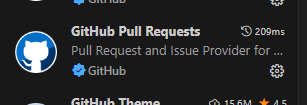
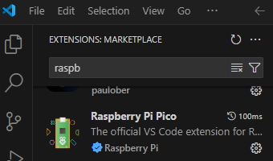
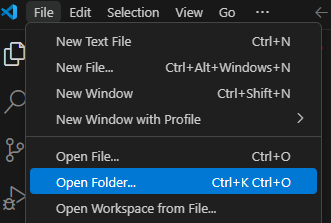
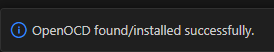
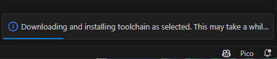
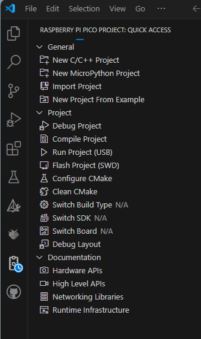
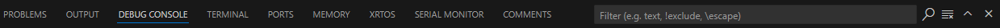

Use a superloop to execute board tests with VSCode and the RPi
extension. This is tested on MacOS, Windows, Windows WSL, Raspberry Pi
Zero and 4, and Ubuntu.

Some nascent features of the program:

o Compiles on MacOS and Windows with the same easy clicks  
     .  Can ask for help from someone with a different type of computer  
o Clear program organization in the superloop, easy to see where/how to change/add things.  
o Can optionally use debugger  
      .  Radical improvement in seeing what the code and hardware are doing  
      .  Eliminates the clumsy button-press and then re-connect USB  
      .  Requires additional Pico or Pico2 to use as SWD interface  
o  One-click Serial monitor for printf and live updates of test results  
      .  prints text buffer that each test created in a full-text-window display  
      .  waits for you to connect before starting testing, so you don't miss it  
o Command input lets you change test behavior while running, for example  
      .   Trigger burn wire on command  
      .   Change from TX only or to RX only or to alternating  
      .   Reset range test histogram of received packets for each power level  
      .   Easy to add new commands  

Do you have git?  On windows I like the bash terminal:

and download cmake if you don't already have it.

git clone <https://github.com/pete4radio/PiTest.git>

Open VS Code, add the extension for git

Add the Raspberry Pi pico extension

Open the PiTest folder

I often see it autonomously say

The can be a long while if you're not on a fast WiFi (for example, close
to the WiFi box)

Open the Raspberry Pi Pico extension

Click "Debug Project"

Select the Serial Monitor terminal window

I2C scan and Pico2 blink is running...
